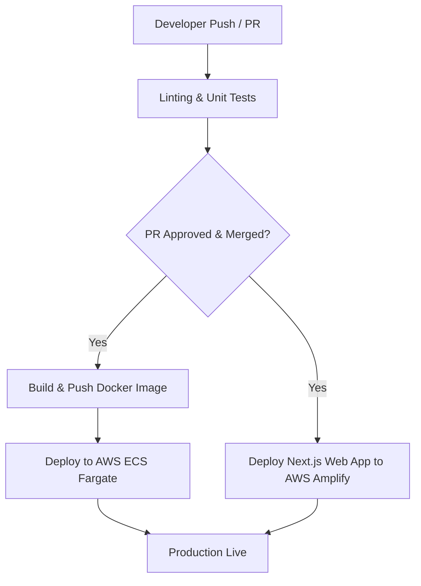

# TeamSync AWS Production Cloud Architecture

This document outlines the production-ready deployment architecture, secrets management, CI/CD pipeline, and scaling strategies on Amazon Web Services (AWS) for TeamSync.

---

## 1. Production Deployment Plan

### A. Backend API (NestJS + Prisma)
*   **AWS Service**: **Amazon ECS (Elastic Container Service) with AWS Fargate**
*   **Rationale**: Fargate provides a serverless container execution environment. This removes the operational overhead of provisioning, configuring, and scaling virtual machines (EC2).
*   **Infrastructure Layout**:
    *   The API containers run in **Private Subnets** to prevent direct public access.
    *   An **Application Load Balancer (ALB)** sits in the **Public Subnets** to distribute incoming HTTPS traffic from the internet to the containers.
    *   An **Auto Scaling Group** adjusts the number of running containers based on CPU and memory usage metrics.

### B. Database (PostgreSQL)
*   **AWS Service**: **Amazon Aurora Serverless v2 (Postgres-compatible)**
*   **Rationale**: Aurora Serverless v2 dynamically scales database compute capacity (ACUs) in fractions of a second based on load. 
*   **Reliability**:
    *   Deployed in a **Multi-AZ (Availability Zone)** configuration for automated failovers and high availability.
    *   Placed in isolated **Private Database Subnets**, accessible *only* by the ECS API security group.

### C. Web Application (Next.js)
*   **AWS Service**: **AWS Amplify Hosting** (alternatively AWS S3 + CloudFront if fully static)
*   **Rationale**: Next.js App Router utilizes Server-Side Rendering (SSR) and Route Handlers. AWS Amplify Hosting has native support for Next.js SSR, managing the serverless execution (via Lambda@Edge or regional lambdas) and serving static files from Amazon S3 via the CloudFront CDN edge network.

### D. Mobile Companion App (React Native / Expo)
*   **Distribution**:
    *   Built using **Expo Application Services (EAS Build)** to compile `.ipa` (iOS) and `.apk`/`.aab` (Android) binaries.
    *   Distributed via the **Apple App Store** and **Google Play Console** beta tracks.
    *   **Expo Updates** (OTA) is used for instant JS bundle updates, bypassing App Store reviews for non-native changes.

---

## 2. Secrets Management

*   **AWS Service**: **AWS Secrets Manager**
*   **Implementation**:
    *   Sensitive credentials (e.g. `DATABASE_URL`, `JWT_SECRET`, and `JWT_REFRESH_SECRET`) are stored securely in AWS Secrets Manager.
    *   They are **never** committed in git or hardcoded.
    *   During deployment, the ECS task definition retrieves these secrets via direct integration, injecting them as container environment variables at runtime. This keeps secrets hidden from CI/CD logs and developers' local configurations.

---

## 3. CI/CD Pipeline (GitHub Actions)

A GitHub Actions workflow initiates on Pull Requests (`main` branch) and deployments:

### Stages
1.  **Test Stage (on PR)**: Runs ESLint, Prettier validation, and Jest unit tests (`npm run test`) for both backend and frontend.
2.  **Build Stage (on Merge to `main`)**:
    *   Logs into **Amazon ECR (Elastic Container Registry)**.
    *   Builds the backend Docker image and pushes it to ECR, tagging it with the commit SHA.
3.  **Deploy Backend Stage**:
    *   Updates the ECS Task Definition with the new ECR image tag.
    *   Performs a **rolling update** deployment on ECS Fargate (ensuring zero downtime).
4.  **Deploy Web Stage**:
    *   Triggers AWS Amplify hosting webhook to pull the latest `main` commit, perform SSR bundling, and deploy to CDN edges.

---

## 4. Scaling Concern & Mitigation

### Scaling Concern: Task Comment Threads "Hot Spotting"
As TeamSync grows, tasks in popular projects could accumulate thousands of comments. Fetching a task via `GET /tasks/:id` requires loading the task details and its entire comment thread. This leads to:
1.  High database read latency (heavy SQL joins on Task and Comment tables).
2.  Database CPU spiking due to redundant queries for identical task views.

### Mitigation Strategy
1.  **Cache-Aside with Redis (Amazon ElastiCache)**:
    *   Introduce Redis to cache the comment threads of active tasks.
    *   On `GET /tasks/:id`, the API first checks Redis. If it's a cache hit, it returns immediately. On cache miss, it queries Aurora, writes to Redis, and returns.
    *   On `POST /tasks/:id/comments`, invalidates the task's cache entry in Redis.
2.  **Pagination and Lazy Loading**:
    *   Decouple comment retrieval from the primary task detail endpoint.
    *   Modify the UI to paginate comments (e.g., `GET /tasks/:id/comments?page=1&limit=20`), reducing database throughput per request.
3.  **RDS Read Replicas**:
    *   Direct read operations (like loading task views) to Aurora Read Replicas, isolating transactional writes (creating comments, updating statuses) to the Primary master node.
