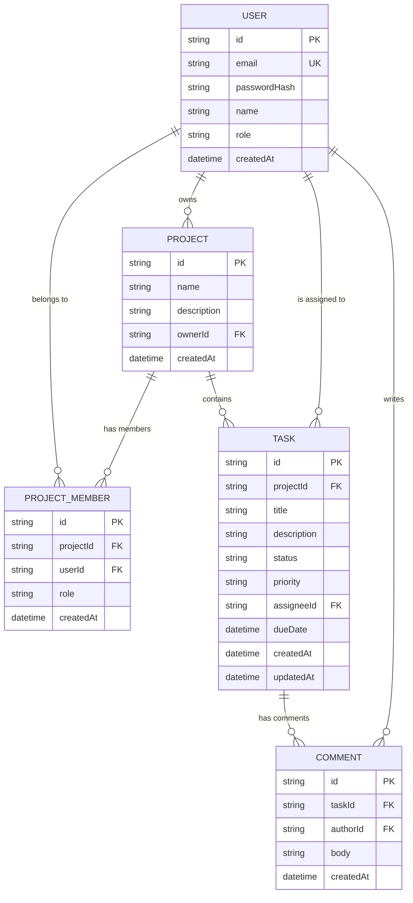

# TeamSync — Full-Stack Project & Task Tracker

> [!IMPORTANT]
> **Technical Assessment Submission**: [Watch the Video Walkthrough on Loom](https://www.loom.com/share/134c272b18bc4188ab4f0d205be1ba87)

TeamSync is a lightweight, responsive, and secure project and task tracking application built for CDAZZDEV's technical assessment. The platform consists of:
1.  **Backend REST API** (NestJS, Prisma, PostgreSQL, Jest, Swagger).
2.  **Web Application** (Next.js App Router, CSS Modules, SWR, BFF Proxy, Zod).
3.  **Mobile Companion App** (React Native, Expo, SecureStore, AsyncStorage Caching, Push Notifications).

---

## 1. Directory Structure

*   `/backend` — NestJS API, PostgreSQL compose, Prisma schema/migrations, and Jest tests.
*   `/web` — Next.js web application with a design-token CSS system.
*   `/mobile` — Expo companion mobile application.
*   `ARCHITECTURE.md` — Production AWS deployment and CI/CD documentation.

---

## 2. Local Setup Instructions

### Prerequisites
*   Node.js v20+ and npm
*   Docker and Docker Compose

### Step 1: Run the Backend API
Navigate to the `/backend` folder.
1.  Copy environment variables:
    ```bash
    cp .env.example .env
    ```
2.  Bring up the PostgreSQL database and NestJS API in Docker:
    ```bash
    docker compose up --build
    ```
    *Note: The containers automatically run Prisma migrations, seed initial users/tasks, and launch the API.*
3.  Access the live API Swagger Documentation:
    ```
    http://localhost:3000/api/docs
    ```
4.  To run Jest unit tests on your host machine:
    ```bash
    npm install
    npm run test
    ```

### Step 2: Run the Next.js Web App
Navigate to the `/web` folder.
1.  Install dependencies:
    ```bash
    npm install
    ```
2.  Run the development server:
    ```bash
    npm run dev
    ```
3.  Open your browser and navigate to:
    ```
    http://localhost:3001
    ```
    *(Next.js will proxy API calls through Route Handlers to the NestJS backend on port 3000).*

### Step 3: Run the Mobile Companion App
Navigate to the `/mobile` folder.
1.  Install dependencies:
    ```bash
    npm install
    ```
2.  Launch the Expo dev server:
    ```bash
    npx expo start
    ```
3.  Scan the QR code with **Expo Go** on a physical device, or run on an emulator (press `a` for Android, `i` for iOS).
4.  Configure the **API Server Base URL** in the app's login view to point to your machine (e.g. `http://10.0.2.2:3000` for Android emulators, `http://localhost:3000` for simulators, or your local network IP `http://192.168.1.XX:3000` for physical devices).

---

## 3. Test Credentials

The database is seeded automatically with the following users (Password: `password123`):
*   **Project Manager**: `manager@teamsync.com` (Can create projects and tasks).
*   **Team Member**: `member@teamsync.com` (View and comment on assigned tasks).
*   **System Admin**: `admin@teamsync.com` (Unrestricted global access).

---

## 4. Part D — Database Design

### Entity Relationship Diagram (ERD)



### Indexing Strategy Note (Database Performance)

When the `Task` table grows to 1M+ rows, executing frequent queries that filter by `projectId`, `status`, and `assigneeId`, and sort by `dueDate` (e.g. for user task lists and dashboard boards) will severely degrade performance. Without proper indexing, PostgreSQL is forced to perform a **sequential scan** through all 1 million rows, which results in `O(N)` search time, or perform expensive index-merging if separate indexes exist.

To optimize this query, we add a **composite B-Tree index** containing all filter fields and the sort key:
```prisma
@@index([projectId, status, assigneeId, dueDate])
```

#### Why this index works:
1.  **Prefix Matching (Filtering)**: The database engine can perform a high-performance index scan using the composite keys `projectId`, `status`, and `assigneeId` in order. It instantly discards irrelevant records, reducing searched items from 1,000,000 to the few hundred matching tasks in `O(log N)` complexity.
2.  **Avoid Sorting in Memory (Filesort)**: Since `dueDate` is the final column in the composite index, the index nodes are stored in sorted order of `dueDate` within matching groups. PostgreSQL retrieves records already ordered, bypassing a costly sorting operation in CPU or temporary disk storage before returning results.
